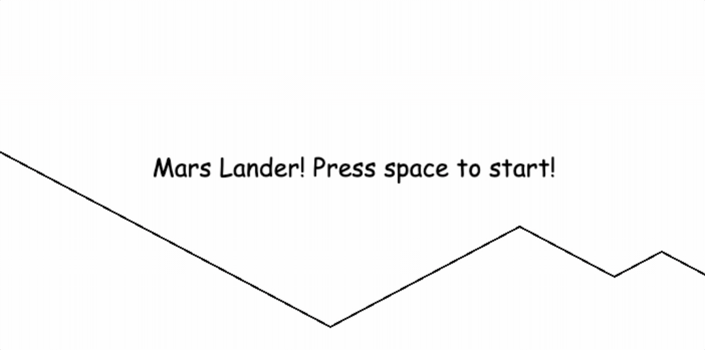

# Building a game with Javascript

Hosted by Tom Meulendijks and Pat Scullion, we've build a Lunar Lander spinoff during this episode of EU Tech Meetup in Maastricht.

## Contents
* `particles.html`: a small warmup project to get acquainted with Javascript inside the browser and creating objects.
* `index.html`: the Lunar Lander game basics with key controls!
* `game.html`: Lunar Lander with a basic terrain, game states ánd fuel!